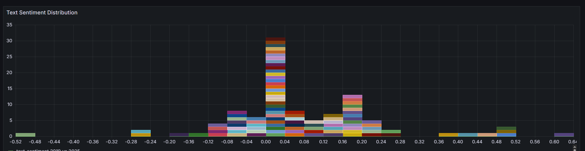

# Reddit Sentiment Analysis

Streams posts from a subreddit (specified in .env), computes sentiment and visualizes it as time series and histogram.  
InfluxDB data and Grafana dashboards are persisted. You can find the dashboard under `grafana_dashboards/`

## Setup

Run with `docker-compose up`, which starts 3 containers:

- Reddit stream
- Grafana
- InfluxDB

Check `docker-compose.yml` and setup environment variables accordingly.  
Grafana and InfluxDB's variables can be what you want.  
For Reddit Stream, use the ones from your <a href="https://www.reddit.com/prefs/apps">reddit apps page</a> for client id and secret. The id will be sent to your email. 
The other variables must match with InfluxDB's variables, except `INFLUXDB_HOST_REDDIT` is just `http://influxdb:8086` and user agent can be any name.
